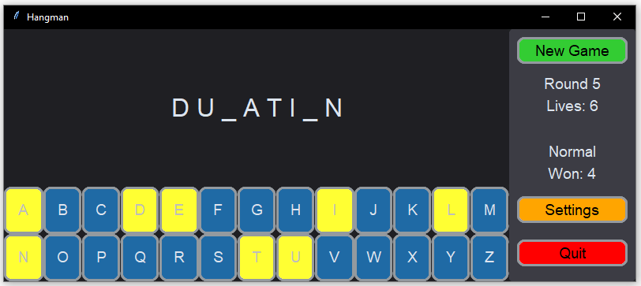
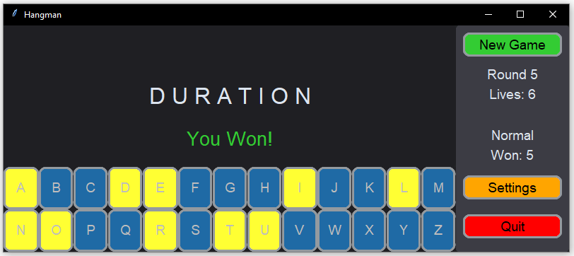
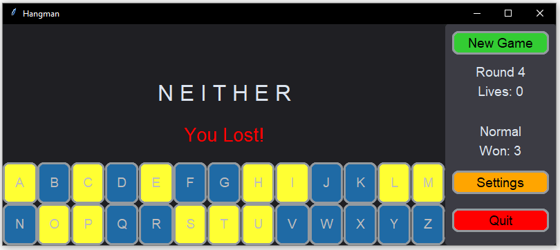
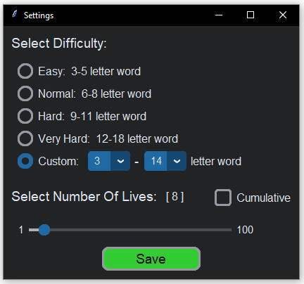

# Hangman Game

## Game Features

- Interactive GUI for endless gameplay
- Full alphabet buttons displayed on-screen
- Easily track which letters were used
- Tracks statistics such as rounds played, lives remaining and rounds won
- Enter the `Settings` menu to change the difficulty, number of lives and game mode
- The secret word will be revealed whether the round is lost or won
- Resizable game screen
- Press the `spacebar` key to instantly start a new game

## Settings
- Choose from 4 pre-defined difficulties or customize your own
- Select the desired `Number Of Lives`
- Enable `Cumulative` game mode to prevent lives from resetting after a round is won

## Images
### 1. Game screen

### 2. Winning a game

### 3. Losing a game

### 4. Settings screen
